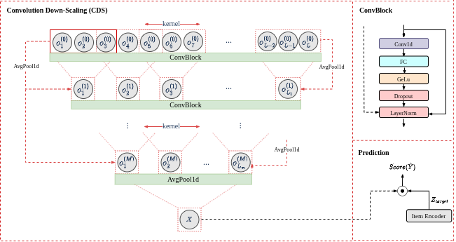

## Rethinking Convolutional Networks for Attribute-Aware Sequential Recommendation

> Shereen Elsayed*, Ngoc Son Le*, Ahmed Rashed, and Lars Schmidt-Thieme<br>
> \* Equal contribution<br>
> Accepted at IJCAI-ECAI 2026

ConvRec is a convolution-based model for attribute- and context-aware sequential recommendation. Instead of relying on self-attention to aggregate the full user sequence, ConvRec uses hierarchical down-scaling convolutional layers to progressively compress a user’s interaction history into a compact sequence representation. The model is evaluated on four Amazon benchmark datasets: `fashion`, `beauty`, `men`, and `game`.

<p align="center">
  
</p>

<p align="center">
  <em>Overview of the ConvRec framework.</em>
</p>

## Data

This project uses the data format from the CARCA repository. 

* raw dataset directory: `./raw/`
    * put [CARCA/Data](https://github.com/ahmedrashed-ml/CARCA) as `./raw/CARCA/`
* data directory: `./data/`

Run preprocessing:

```bash
python preprocess.py prepare --dname fashion
python preprocess.py prepare --dname beauty
python preprocess.py prepare --dname men
python preprocess.py prepare --dname game
```


Run the code: 

```bash
python entry.py convrec/men
```

## Citation
```
@inproceedings{elsayed2026convrec,
  title     = {Rethinking Convolutional Networks for Attribute-Aware Sequential Recommendation},
  author    = {Elsayed, Shereen and Le, Ngoc Son and Rashed, Ahmed and Schmidt-Thieme, Lars},
  booktitle = {Proceedings of the Thirty-Fifth International Joint Conference on Artificial Intelligence, IJCAI-ECAI 2026},
  year      = {2026},
  note      = {To appear}
}
```
